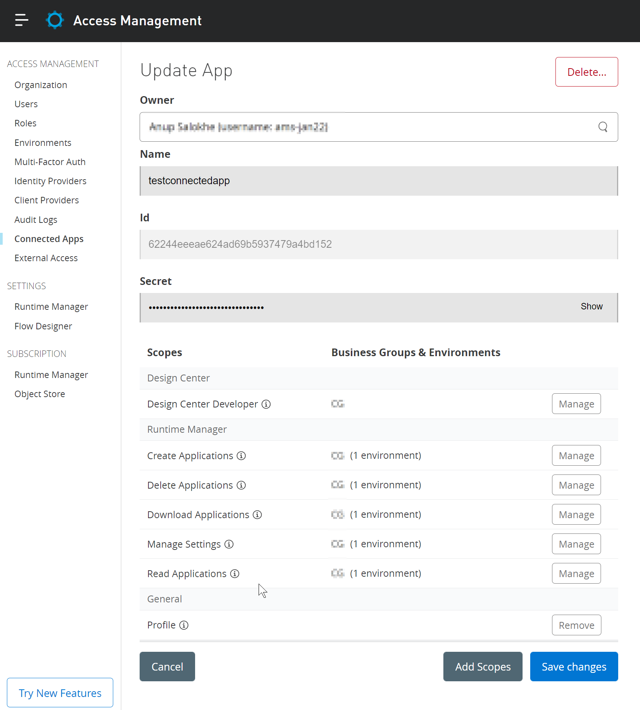

# mule-connected-app
  Application demonstrating various authentication methods for mule app deployments.
  Check various branches for different methods. 
-   Deployment of mule application to cloudhub using username and password

    **Branch Name: username-password**

-   Deployment of mule application to cloudhub using connected app

    **Branch Name: connected-app**

-   Deployment of mule application to cloudhub using username and password from Settings.xml

    **Branch Name: username-password-ext-setting**

-   Deployment of mule application to cloudhub using connected app settings defined in settings.xml

    **Branch Name: connected-app-ext-setting**

## Prerequisite:
1. Create a User or Connected app with required scope.

   Note that the connected App credentials must have the **Design Center Developer** access scope.
   
   
2. Mule Applicaiton

## References:
-   https://docs.mulesoft.com/access-management/connected-apps-overview
-   https://help.mulesoft.com/s/article/How-to-use-Connected-Apps-with-CI-CD
-   https://docs.mulesoft.com/exchange/to-publish-assets-maven#publish-and-consume-federated-assets
-   https://docs.mulesoft.com/mule-runtime/4.4/deploy-to-cloudhub

